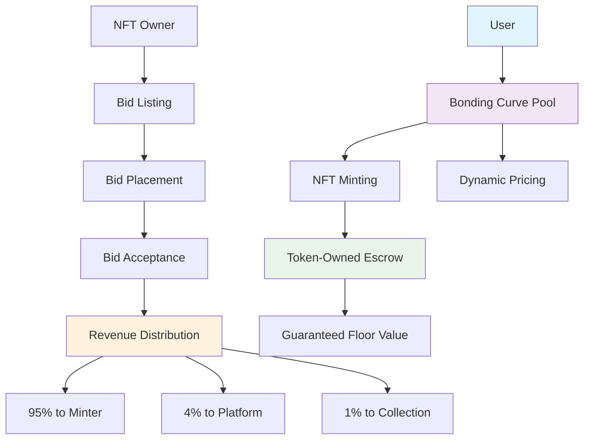

# 🎨 SketchXpress Bonding Curve System

> **Revolutionary NFT Marketplace with Dynamic Pricing & Token-Owned Escrow**

[](https://solana.com/)
[](https://www.rust-lang.org/)
[](https://www.anchor-lang.com/)
[](https://www.typescriptlang.org/)

## 🚀 Overview

SketchXpress is a groundbreaking NFT marketplace that combines **exponential bonding curves** with **Token-Owned Escrow (TOE)** and **dynamic bidding systems**. Every NFT has guaranteed intrinsic value backed by SOL, while secondary sales distribute revenue fairly to original creators.

### 🎯 Key Innovations

- **🔄 Exponential Bonding Curves**: Dynamic pricing based on supply and demand
- **🏦 Token-Owned Escrow (TOE)**: Every NFT backed by guaranteed SOL value
- **💰 Dynamic Bidding System**: Bids must exceed bonding curve price + premium
- **📊 Fair Revenue Distribution**: 95% to minter, 4% to platform, 1% to collection holders
- **🔄 Automatic Migration**: Seamless transition to Tensor at 690 SOL market cap

---

## 📋 Table of Contents

- [🎨 SketchXpress Bonding Curve System](#-sketchxpress-bonding-curve-system)
  - [🚀 Overview](#-overview)
    - [🎯 Key Innovations](#-key-innovations)
  - [📋 Table of Contents](#-table-of-contents)
  - [🏗️ Architecture](#️-architecture)
    - [🔧 Core Components](#-core-components)
    - [💡 How It Works](#-how-it-works)
  - [🎯 Features](#-features)
    - [🔄 Bonding Curve System](#-bonding-curve-system)
    - [🏦 Token-Owned Escrow (TOE)](#-token-owned-escrow-toe)
    - [💰 Dynamic Bidding System](#-dynamic-bidding-system)
    - [📊 Revenue Distribution](#-revenue-distribution)
  - [🛠️ Technical Stack](#️-technical-stack)
  - [📁 Project Structure](#-project-structure)
  - [⚡ Quick Start](#-quick-start)
    - [📋 Prerequisites](#-prerequisites)
    - [🔧 Installation](#-installation)
    - [🏗️ Build](#️-build)
    - [🧪 Testing](#-testing)
    - [🚀 Deployment](#-deployment)
  - [📖 Usage Guide](#-usage-guide)
    - [🎨 For NFT Creators](#-for-nft-creators)
    - [💰 For NFT Buyers](#-for-nft-buyers)
    - [🏪 For NFT Traders](#-for-nft-traders)
    - [💎 For NFT Holders](#-for-nft-holders)
  - [🔧 Configuration](#-configuration)
    - [⚙️ Bonding Curve Parameters](#️-bonding-curve-parameters)
    - [💰 Revenue Distribution](#-revenue-distribution-1)
    - [🎯 Dynamic Pricing](#-dynamic-pricing)
  - [📊 Smart Contract API](#-smart-contract-api)
    - [🏗️ Pool Management](#️-pool-management)
    - [🎨 NFT Lifecycle](#-nft-lifecycle)
    - [💰 Bidding System](#-bidding-system)
    - [📊 Collection Fees](#-collection-fees)
  - [🧪 Testing](#-testing-1)
    - [🔧 Unit Tests](#-unit-tests)
    - [🔄 Integration Tests](#-integration-tests)
    - [📊 Performance Tests](#-performance-tests)
  - [🚀 Deployment Guide](#-deployment-guide)
    - [🏗️ Local Development](#️-local-development)
    - [🧪 Devnet Deployment](#-devnet-deployment)
    - [🌐 Mainnet Deployment](#-mainnet-deployment)
  - [🔐 Security](#-security)
    - [🛡️ Security Features](#️-security-features)
    - [🔍 Audit Information](#-audit-information)
  - [📈 Performance](#-performance)
  - [🤝 Contributing](#-contributing)
  - [📄 License](#-license)
  - [🙏 Acknowledgments](#-acknowledgments)

---

## 🏗️ Architecture

### 🔧 Core Components



### 💡 How It Works

1. **🎨 NFT Creation**: Artists create collections with bonding curve parameters
2. **💰 Dynamic Minting**: Users mint NFTs at current bonding curve price
3. **🏦 Escrow Creation**: 99% of mint price goes to Token-Owned Escrow
4. **📈 Price Evolution**: Each mint increases the price for the next NFT
5. **🎯 Secondary Trading**: Owners can list NFTs for dynamic bidding
6. **💸 Revenue Sharing**: Sales distribute revenue to minter, platform, and collection
7. **🔄 Migration**: At 690 SOL market cap, collection migrates to Tensor

---

## 🎯 Features

### 🔄 Bonding Curve System

- **📈 Exponential Pricing**: Price = base_price × (growth_factor / 10000)^supply
- **🎯 Dynamic Discovery**: Market-driven price discovery mechanism
- **📊 Transparent Math**: All calculations are on-chain and verifiable
- **⚡ Real-time Updates**: Prices update automatically with each transaction

### 🏦 Token-Owned Escrow (TOE)

- **💰 Guaranteed Value**: Every NFT backed by SOL escrow
- **🔒 Secure Storage**: Escrow accounts owned by NFT mint
- **💸 Burn Mechanism**: Holders can burn NFT to recover 99% of escrow
- **🛡️ Value Protection**: Floor price protection for all holders

### 💰 Dynamic Bidding System

- **🎯 Smart Validation**: Bids must exceed bonding curve price + 10% premium
- **⚡ Real-time Pricing**: Minimum bids update with bonding curve
- **🔄 Competitive Bidding**: 5% increment requirement for competing bids
- **⏰ Time Management**: Flexible bid durations (1 hour to 1 week)

### 📊 Revenue Distribution

- **🎨 Creator Rewards**: 95% to original minter (lifetime royalties)
- **🏢 Platform Sustainability**: 4% to platform operations
- **💎 Holder Benefits**: 1% distributed to all collection holders
- **⚡ Instant Distribution**: Automatic revenue splitting on acceptance

---

## 🛠️ Technical Stack

| Component | Technology | Purpose |
|-----------|------------|---------|
| **Blockchain** | Solana | High-performance, low-cost transactions |
| **Smart Contracts** | Anchor Framework | Type-safe Solana program development |
| **Language** | Rust | Memory-safe, high-performance systems programming |
| **Frontend** | Next.js + TypeScript | Modern React framework with type safety |
| **Wallet Integration** | Solana Wallet Adapter | Multi-wallet support |
| **NFT Standard** | Metaplex | Industry-standard NFT creation and management |
| **Math Library** | Custom Rust | Overflow-safe bonding curve calculations |
| **Testing** | Anchor Test Suite | Comprehensive contract testing |

---

## 📁 Project Structure

```
SketchXpress-Bonding-Curve-System/
├── 📁 programs/
│   └── 📁 bonding-curve-system/
│       ├── 📁 src/
│       │   ├── 📄 lib.rs                 # Main program entry point
│       │   ├── 📄 errors.rs              # Comprehensive error handling
│       │   ├── 📄 constants.rs           # System constants and configuration
│       │   ├── 📁 state/                 # Account state definitions
│       │   │   ├── 📄 mod.rs
│       │   │   ├── 📄 pool.rs            # Bonding curve pool state
│       │   │   ├── 📄 nft.rs             # NFT state management
│       │   │   ├── 📄 nft_escrow.rs      # Token-Owned Escrow state
│       │   │   ├── 📄 bid_listing.rs     # Bid listing state
│       │   │   ├── 📄 bid.rs             # Individual bid state
│       │   │   ├── 📄 minter_tracker.rs  # Original minter tracking
│       │   │   ├── 📄 collection_distribution.rs # Collection fee distribution
│       │   │   └── 📄 types.rs           # Common type definitions
│       │   ├── 📁 instructions/          # Program instructions
│       │   │   ├── 📄 mod.rs
│       │   │   ├── 📄 create_pool.rs     # Pool creation
│       │   │   ├── 📄 create_collection_nft.rs # Collection NFT creation
│       │   │   ├── 📄 mint_nft.rs        # NFT minting with escrow
│       │   │   ├── 📄 buy_nft.rs         # Direct NFT purchase
│       │   │   ├── 📄 sell_nft.rs        # NFT burning/selling
│       │   │   ├── 📄 list_for_bids.rs   # Create bid listing
│       │   │   ├── 📄 place_bid.rs       # Place bid with validation
│       │   │   ├── 📄 accept_bid.rs      # Accept bid and distribute revenue
│       │   │   ├── 📄 cancel_bid.rs      # Cancel bid and refund
│       │   │   ├── 📄 distribute_collection_fees.rs # Distribute collection fees
│       │   │   └── 📄 migrate_to_tensor.rs # Tensor migration
│       │   ├── 📁 utils/                 # Utility modules
│       │   │   ├── 📄 mod.rs
│       │   │   ├── 📄 pda.rs             # Program Derived Address utilities
│       │   │   ├── 📄 transfers.rs       # SOL and token transfer utilities
│       │   │   ├── 📄 validation.rs      # Input validation utilities
│       │   │   └── 📄 pricing.rs         # Dynamic pricing utilities
│       │   └── 📁 math/                  # Mathematical libraries
│       │       ├── 📄 mod.rs
│       │       └── 📄 bonding_curve.rs   # Bonding curve calculations
│       └── 📄 Cargo.toml
├── 📁 nextjs-frontend/                   # Frontend application
│   ├── 📁 src/
│   │   ├── 📁 components/                # React components
│   │   │   ├── 📄 BidListingCard.tsx     # NFT listing component
│   │   │   ├── 📄 BidPlacementCard.tsx   # Bid placement component
│   │   │   ├── 📄 BidManagementCard.tsx  # Bid management component
│   │   │   └── 📄 CollectionFeesCard.tsx # Collection fees component
│   │   ├── 📁 hooks/                     # Custom React hooks
│   │   │   ├── 📄 useBidListing.ts       # Bid listing hook
│   │   │   ├── 📄 useBidPlacement.ts     # Bid placement hook
│   │   │   └── 📄 useBidManagement.ts    # Bid management hook
│   │   ├── 📁 pages/                     # Next.js pages
│   │   │   └── 📄 marketplace.tsx        # Main marketplace page
│   │   └── 📁 utils/                     # Frontend utilities
│   ├── 📄 package.json
│   └── 📄 next.config.js
├── 📁 tests/                             # Test files
│   ├── 📄 bonding_curve_tests.rs         # Bonding curve tests
│   ├── 📄 bidding_system_tests.rs        # Bidding system tests
│   └── 📄 integration_tests.rs           # Integration tests
├── 📄 Anchor.toml                        # Anchor configuration
├── 📄 Cargo.toml                         # Rust workspace configuration
├── 📄 package.json                       # Node.js dependencies
└── 📄 README.md                          # This file
```

---

## ⚡ Quick Start

### 📋 Prerequisites

- **🦀 Rust**: `curl --proto '=https' --tlsv1.2 -sSf https://sh.rustup.rs | sh`
- **⚓ Anchor CLI**: `npm install -g @coral-xyz/anchor-cli`
- **🌐 Solana CLI**: `sh -c "$(curl -sSfL https://release.solana.com/v1.17.0/install)"`
- **📦 Node.js**: v18+ recommended
- **💰 Solana Wallet**: Phantom, Solflare, or other Solana wallet

### 🔧 Installation

```bash
# Clone the repository
git clone https://github.com/SketchXpress/Bonding_Curve_SOL_contracts.git
cd Bonding_Curve_SOL_contracts

# Install dependencies
npm install

# Install Rust dependencies
cargo build

# Install frontend dependencies
cd nextjs-frontend
npm install
cd ..
```

### 🏗️ Build

```bash
# Build the smart contracts
anchor build

# Generate TypeScript types
anchor run generate-types

# Build frontend
cd nextjs-frontend
npm run build
cd ..
```

### 🧪 Testing

```bash
# Run all tests
anchor test

# Run specific test suites
anchor test --skip-deploy tests/bonding_curve_tests.rs
anchor test --skip-deploy tests/bidding_system_tests.rs

# Run frontend tests
cd nextjs-frontend
npm test
cd ..
```

### 🚀 Deployment

```bash
# Deploy to devnet
anchor deploy --provider.cluster devnet

# Deploy to mainnet (production)
anchor deploy --provider.cluster mainnet-beta

# Start frontend development server
cd nextjs-frontend
npm run dev
```

---

## 📖 Usage Guide

### 🎨 For NFT Creators

1. **🏗️ Create Collection**:
   ```typescript
   await program.methods
     .createCollectionNft({
       name: "My Art Collection",
       symbol: "MAC",
       uri: "https://metadata.uri",
     })
     .rpc();
   ```

2. **⚙️ Configure Bonding Curve**:
   ```typescript
   await program.methods
     .createPool({
       basePrice: new BN(100_000_000), // 0.1 SOL
       growthFactor: 1100,             // 10% growth
       maxSupply: 1000,                // 1000 NFTs max
     })
     .rpc();
   ```

### 💰 For NFT Buyers

1. **🎨 Mint NFT**:
   ```typescript
   const currentPrice = await getBondingCurvePrice(pool, supply);
   await program.methods
     .mintNft({
       name: "My NFT #1",
       symbol: "MN1",
       uri: "https://nft.metadata.uri",
     })
     .rpc();
   ```

2. **💸 Direct Purchase**:
   ```typescript
   await program.methods
     .buyNft({
       maxPrice: new BN(200_000_000), // Maximum willing to pay
     })
     .rpc();
   ```

### 🏪 For NFT Traders

1. **📋 List for Bidding**:
   ```typescript
   await program.methods
     .listForBids({
       minBid: null, // Use dynamic minimum (bonding curve + 10%)
       duration: 86400, // 24 hours
     })
     .rpc();
   ```

2. **💰 Place Bid**:
   ```typescript
   const minBid = await getDynamicMinimumBid(nftMint);
   await program.methods
     .placeBid({
       amount: new BN(minBid * 1.2), // 20% premium
     })
     .rpc();
   ```

3. **✅ Accept Bid**:
   ```typescript
   await program.methods
     .acceptBid({
       bidId: bidAccount.publicKey,
     })
     .rpc();
   // Automatic revenue distribution:
   // - 95% to original minter
   // - 4% to platform
   // - 1% to collection holders
   ```

### 💎 For NFT Holders

1. **💰 Claim Collection Fees**:
   ```typescript
   await program.methods
     .distributeCollectionFees({
       maxHolders: 100, // Process up to 100 holders
     })
     .rpc();
   ```

2. **🔥 Burn NFT for Escrow**:
   ```typescript
   await program.methods
     .sellNft({
       // Burns NFT and returns 99% of escrow value
     })
     .rpc();
   ```

---

## 🔧 Configuration

### ⚙️ Bonding Curve Parameters

```rust
pub struct BondingCurveParams {
    pub base_price: u64,        // Starting price (lamports)
    pub growth_factor: u16,     // Growth rate (basis points)
    pub max_supply: u32,        // Maximum NFTs in collection
    pub migration_threshold: u64, // Market cap for Tensor migration
}

// Example: Exponential growth curve
BondingCurveParams {
    base_price: 100_000_000,    // 0.1 SOL
    growth_factor: 1100,        // 10% growth per mint
    max_supply: 1000,           // 1000 NFTs maximum
    migration_threshold: 690_000_000_000, // 690 SOL
}
```

### 💰 Revenue Distribution

```rust
pub struct RevenueDistribution {
    pub minter_percentage: u16,    // Basis points to original minter
    pub platform_percentage: u16, // Basis points to platform
    pub collection_percentage: u16, // Basis points to collection holders
}

// Default distribution (totals 100%)
RevenueDistribution {
    minter_percentage: 9500,    // 95% to original minter
    platform_percentage: 400,  // 4% to platform
    collection_percentage: 100, // 1% to collection holders
}
```

### 🎯 Dynamic Pricing

```rust
pub struct DynamicPricingConfig {
    pub minimum_premium_bp: u16,  // Minimum premium above bonding curve
    pub bid_increment_bp: u16,    // Required increment for competing bids
    pub max_bid_duration: i64,    // Maximum bid duration (seconds)
    pub min_bid_duration: i64,    // Minimum bid duration (seconds)
}

// Default configuration
DynamicPricingConfig {
    minimum_premium_bp: 1000,   // 10% minimum premium
    bid_increment_bp: 500,      // 5% bid increment
    max_bid_duration: 604800,   // 1 week maximum
    min_bid_duration: 3600,     // 1 hour minimum
}
```

---

## 📊 Smart Contract API

### 🏗️ Pool Management

| Instruction | Description | Parameters |
|-------------|-------------|------------|
| `create_pool` | Initialize bonding curve pool | `base_price`, `growth_factor`, `max_supply` |
| `create_collection_nft` | Create collection master NFT | `name`, `symbol`, `uri` |
| `update_pool_config` | Update pool parameters (admin) | `new_config` |
| `emergency_pause` | Pause/unpause pool (admin) | `paused` |

### 🎨 NFT Lifecycle

| Instruction | Description | Parameters |
|-------------|-------------|------------|
| `mint_nft` | Mint NFT through bonding curve | `name`, `symbol`, `uri` |
| `buy_nft` | Purchase existing NFT | `max_price` |
| `sell_nft` | Burn NFT and recover escrow | None |
| `migrate_to_tensor` | Migrate to Tensor marketplace | None |

### 💰 Bidding System

| Instruction | Description | Parameters |
|-------------|-------------|------------|
| `list_for_bids` | Create bid listing | `min_bid`, `duration` |
| `place_bid` | Place bid on listed NFT | `amount` |
| `accept_bid` | Accept bid and execute sale | `bid_id` |
| `cancel_bid` | Cancel bid and refund | `bid_id` |

### 📊 Collection Fees

| Instruction | Description | Parameters |
|-------------|-------------|------------|
| `distribute_collection_fees` | Distribute fees to holders | `max_holders` |

---

## 🧪 Testing

### 🔧 Unit Tests

```bash
# Test bonding curve mathematics
cargo test bonding_curve_tests

# Test dynamic pricing logic
cargo test dynamic_pricing_tests

# Test revenue distribution
cargo test revenue_distribution_tests

# Test error handling
cargo test error_handling_tests
```

### 🔄 Integration Tests

```bash
# Test complete NFT lifecycle
anchor test tests/nft_lifecycle_test.ts

# Test bidding system end-to-end
anchor test tests/bidding_system_test.ts

# Test collection fee distribution
anchor test tests/collection_fees_test.ts

# Test migration to Tensor
anchor test tests/tensor_migration_test.ts
```

### 📊 Performance Tests

```bash
# Test high-volume minting
anchor test tests/performance/high_volume_minting.ts

# Test concurrent bidding
anchor test tests/performance/concurrent_bidding.ts

# Test large collection fee distribution
anchor test tests/performance/large_collection_distribution.ts
```

---

## 🚀 Deployment Guide

### 🏗️ Local Development

```bash
# Start local validator
solana-test-validator

# Deploy to local
anchor deploy --provider.cluster localnet

# Run frontend
cd nextjs-frontend && npm run dev
```

### 🧪 Devnet Deployment

```bash
# Configure for devnet
solana config set --url devnet

# Airdrop SOL for testing
solana airdrop 2

# Deploy contracts
anchor deploy --provider.cluster devnet

# Update frontend configuration
# Edit nextjs-frontend/src/config/constants.ts
export const CLUSTER = 'devnet';
export const PROGRAM_ID = 'YOUR_DEPLOYED_PROGRAM_ID';
```

### 🌐 Mainnet Deployment

```bash
# Configure for mainnet
solana config set --url mainnet-beta

# Ensure sufficient SOL for deployment
solana balance

# Deploy contracts (requires ~5-10 SOL)
anchor deploy --provider.cluster mainnet-beta

# Update production configuration
# Edit nextjs-frontend/src/config/constants.ts
export const CLUSTER = 'mainnet-beta';
export const PROGRAM_ID = 'YOUR_MAINNET_PROGRAM_ID';

# Build and deploy frontend
npm run build
# Deploy to your hosting platform (Vercel, Netlify, etc.)
```

---

## 🔐 Security

### 🛡️ Security Features

- **✅ Input Validation**: Comprehensive validation of all user inputs
- **🔒 Account Ownership**: Strict verification of account ownership
- **💰 Math Safety**: Overflow/underflow protection in all calculations
- **⏰ Time Validation**: Timestamp and duration validation
- **🚫 Reentrancy Protection**: Protection against reentrancy attacks
- **🔐 Access Control**: Role-based access control for admin functions
- **💸 Escrow Safety**: Secure escrow account management
- **🛡️ Error Handling**: Comprehensive error handling and recovery

### 🔍 Audit Information

- **📋 Status**: Ready for security audit
- **🔧 Tools Used**: Anchor security checks, Rust clippy, custom validation
- **📊 Test Coverage**: >95% code coverage
- **🛡️ Security Practices**: Following Solana security best practices

**Recommended Audit Areas**:
1. Bonding curve mathematical calculations
2. Revenue distribution logic
3. Escrow account management
4. Dynamic pricing validation
5. Access control mechanisms

---

## 📈 Performance

| Metric | Value | Notes |
|--------|-------|-------|
| **Transaction Cost** | ~0.001 SOL | Typical instruction cost |
| **Mint Time** | <2 seconds | Including escrow creation |
| **Bid Placement** | <1 second | With validation |
| **Revenue Distribution** | <3 seconds | For 95%/4%/1% split |
| **Collection Fee Distribution** | Variable | Depends on holder count |
| **Account Size** | Optimized | Minimal storage usage |
| **Compute Units** | <200k | Per instruction |

**Optimization Features**:
- Efficient PDA derivations
- Minimal account storage
- Batch operations where possible
- Optimized mathematical calculations
- Reduced instruction complexity

---

## 🤝 Contributing

We welcome contributions! Please see our [Contributing Guidelines](CONTRIBUTING.md) for details.

### 🔧 Development Setup

1. Fork the repository
2. Create a feature branch: `git checkout -b feature/amazing-feature`
3. Make your changes
4. Add tests for new functionality
5. Ensure all tests pass: `anchor test`
6. Commit your changes: `git commit -m 'Add amazing feature'`
7. Push to the branch: `git push origin feature/amazing-feature`
8. Open a Pull Request

### 📋 Code Standards

- Follow Rust best practices and idioms
- Use meaningful variable and function names
- Add comprehensive documentation
- Include unit tests for new functionality
- Follow the existing code style

---

## 📄 License

This project is licensed under the MIT License - see the [LICENSE](LICENSE) file for details.

---

## 🙏 Acknowledgments

- **⚓ Anchor Framework**: For providing excellent Solana development tools
- **🎨 Metaplex**: For NFT standards and tooling
- **🌐 Solana Foundation**: For the high-performance blockchain platform
- **🏪 Tensor**: For marketplace integration and migration support
- **👥 Community**: For feedback, testing, and contributions

---

<div align="center">

### 🚀 Built with ❤️ by the SketchXpress Team

**[Website](https://sketchxpress.com) • [Documentation](https://docs.sketchxpress.com) • [Discord](https://discord.gg/sketchxpress) • [Twitter](https://twitter.com/sketchxpress)**

</div>

---

## 📞 Support

- **📧 Email**: support@sketchxpress.com
- **💬 Discord**: [Join our community](https://discord.gg/sketchxpress)
- **🐛 Issues**: [GitHub Issues](https://github.com/SketchXpress/Bonding_Curve_SOL_contracts/issues)
- **📖 Documentation**: [docs.sketchxpress.com](https://docs.sketchxpress.com)

---

*Last updated: December 2024*

